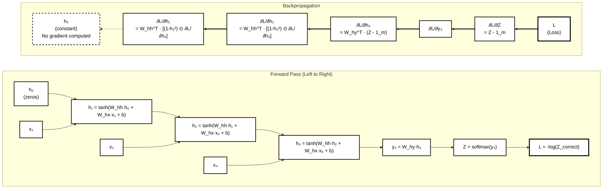

# Recurrent Neural Networks ⛓️

Whereas CNNs intuitively work with multi-dimensional data, often in the form of images or videos, what if we wanted to analyze a stream of data continuously as it gets fed into the network?

- Consider a **string of text that needs to be read left to right, or a sequence of equations or steps that need to performed in order.**

In such situations we need to have a sort of *memory* that keeps track of prior processed input. Each input is processed at certain time steps, and we need to remember prior timesteps to develop a continuously changing understanding of what has been processed so far!

Recurrent Neural Networks maintain a hidden state that is updated as the input is processed over time. For each time step after the initial one, a reccurent neural network updates a hidden state based on its pre-existing hidden state value and the current input being processed.

- **This sort of processing technique resembles a loop of data flow, where each piece of data informs the hidden state which then contributes to informing the next piece of data and so forth.**

Suppose a hidden state $h_t$ at some time $t$ and the current input $x_t$

- **The current hidden state is some combination / function of the prior hidden state (i.e. at $t-1$) and the current input $x_t$**

$$h(t) = f(h_{t - 1}, x_t)$$

...

By integrating this information by constantly updating the hidden state over-time, you can see and prove that the final output is dependent on a chain of hidden states which all integrate prior inputs! We can unroll this function by simply breaking down the recursive cases:

$$h(t) = f(h_{t - 1}, x_t)$$

Working backwards:

$$h(t - 1) = f(h_{t - 2}, x_{t -1})$$
$$h(t - 2) = f(h_{t - 3}, x_{t -2})$$

Working forwards:

$$h(t+1) = f(h_{t}, x_{t+1})$$
$$h(t+2) = f(h_{t+1}, x_{t+2})$$

$$\cdots$$

**We can unroll the function in either direction as long as we have the inputs and you can see how this forms a chain of dependencies.**

- But what should the initial value of the hidden state be set to? (i.e. **what should $h_0$ be**?)

- What is the actual function, $h$?

The function we perform with the prior hidden output and current observation is very similar to the weighted sum calculation we make in traditional MLP networks.

- Instead of one weight in $y = mx + b$, we apply 3 weights!

The hidden function can be thought of as:

$$h_t = \sigma(W_{hh}h_{t-1} + W_{xh}x_t + b_h)$$

- $h_t$ is the hidden state at time $t$
- $\sigma$ will be an activation function of your choice (usually ReLu or tanh)
- $W_{hh}, W_{xh}, b_h$ are all weight matrices
- $b_h$ is a bias vector

**Note that the output of $h_t$ for the final hidden state is not guaranteed to be in a preferable dimensionality.**

- Just like with CNNs and MLPs, the final hidden layer needs to be attached to a sort of *adapter* that converts the dimensionality.

But more importantly, **unlike CNNs or MLP architecture, the dimensions of the hidden layer never change**

Because the dimensionality tends to stay constant, we need to introduce a *dimensionality* adapter after the final hidden state computation in order to properly interpret the output of the RNN and compute a proper loss.

- The hidden state calculations involve a reccurent sequence of activations, but an additional step needs to be taken from the last step to generate an output:

$$y = \sigma_2(W_{\phi} \cdot h_{\text{final}} + B)$$

- $W_{\phi}$ is the weight matrix responsible for transforming the final hidden state into a desired output. This weighted matrix could be coming from a fully connected layer akin to a softmax transformation or something else!

- $B$ represents the biases associated with the transformation layer.

- $\sigma_2$ is another activation function that may be different that $\sigma$ which was used in the hidden state computations.

**The important thing to note is that this final equation is applied via a dense layer, not via a sequence. This is identical to how CNN outputs are eventually processed for the purposes of classification!**

## Chain Rule and Backpropagation ➿

So the general flow of an RNN can be said to look like as follows:

$$h_1 = \sigma(W_{hh} \cdot h_{0} + W_{xh} \cdot x_1 + b_{h})$$

$$h_2 = \sigma(W_{hh} \cdot h_{1} + W_{xh} \cdot x_2 + b_{h})$$

$$h_3 = \sigma(W_{hh} \cdot h_{2} + W_{xh} \cdot x_3 + b_{h})$$

$$Z = \sigma_2(W_{\phi} \cdot h_{3} + B)$$

$L(Z, y)$ will be some loss function that compares the true value against the outputted value.

- For now lets ignore the presence of the bias term and suppose that the activation function, $\sigma$, is $\tanh$

- Lets also assume that the activation function placed on the final layer of weights and inputs, $\sigma_2$, is **Softmax**

- - $n$ is the number of classes

- Lastly lets assume that the loss model is a simple crossentropy function

Then our model's forward pass can be summarized via these equations:

$$h_t = \tanh{(W_{xh}x_{t} + W_{hh}h_{t -1})}$$

$$y_t = W_{hy}h_t = [y_1, y_2, \ldots, y_n]$$

$$Z_i = Softmax(y_t) = \frac{e^{y_i}}{\Sigma_{j=1}^{n}e^{y_j}}$$

$$loss = \text{crossentropy}(Z) = -\log{(Z_m)}$$

- **$m$ is the true class index**

For the backwards pass **we must start with the last step of the forwards pass and compute gradients from there**.

Lets start by computing intermediate gradients, which are gradients of the loss with respect to the hidden states themselves

## Phase 1: Computing Intermeadiate Gradients

---

1) Compute the gradient of the loss with respect to the softmax output $\frac{\partial L}{\partial Z_i}$

$$\frac{\partial L}{\partial Z_i} = \begin{cases}
-\frac{1}{Z_m} & \text{if } i = m \\ 0 & \text{if } i \neq m
\end{cases}$$

---

2) Calculate the gradient of the softmax output with respect to the logits. $\frac{\partial Z }{\partial y}$

- The output of the softmax function is probabilities for each class. The format of the logits array is the raw, unbounded scores resulting directly from the network. The softmax function serves to **normalize the raw logits.**

**The key insight is that the numerator of the softmax function, $e^{y_i}$ is only dependent on the single logit $y_i$, but the denominator, $\Sigma_{j=1}^{n}e^{y_j}$ depends on ALL logits.**

When we want to take the derivative of the softmax outputs with respect to the logits, we must consider each **combination** of output index $i$ and input (logit) index $j$.

- So when we want to take the derivative of all outputs from the softmax function with respect to the logits, $y$, we can split up these logits into two categories.

Diagonal case ($i=j$): 
    When the softmax output $Z_i$ is differentiated with respect to its corresponding logit $y_i$​

Off-diagonal case ($i \neq j$): 
    When the softmax output $Z_i$​ is differentiated with respect to a different logit $y_j$​

**For the sake of not mixing up variables, from here on the denominator's summation will use the $k$ variable.**

We can split the derivative calulcation into two cases:

$$

\begin{cases}

\frac{\partial Z_i}{\partial y_i} = \frac{\partial}{\partial y_i} \frac{e^{y_i}}{\Sigma_{k=1}^{n}e^{y_k}} \\
\frac{\partial Z_i}{\partial y_j} = \frac{\partial}{\partial y_j} \frac{e^{y_i}}{\Sigma_{k=1}^{n}e^{y_k}} \\

\end{cases}

$$

If you think of the outputs of $y$ and $Z$ as existing in a grid, then the first case represents the diagonal elements, which are the outputs of the softmax function where the logit, $y_i$ corresponds with the softmax calculation for that exact logit.

- - This sort of representation is also called a Jacobian matrix

### Derivative for $i = j$ case:

$$\frac{\partial Z_i}{\partial y_i} = \frac{\partial}{\partial y_i} (\frac{e^{y_i}}{\Sigma_{k=1}^{n}e^{y_k}})$$

- We can use the quotient rule: 

Quotient rule:

If $h(x) = \frac{f(x)}{g(x)}$ and $f$ and $g$ are differentiable, and $g$ is not 0, then

$$\frac{dh}{dx} = \frac{\frac{df}{dx}g(x) - \frac{dg}{dx}f(x)}{(g(x))^2}$$

Therefore:

$$\frac{\partial Z_i}{\partial y_i} = \frac{\frac{\partial}{\partial y_i}(e^{y_i}) \cdot \Sigma_{k=1}^{n}e^{y_k} - \frac{\partial}{\partial y_i} (\Sigma_{k=1}^{n}e^{y_k}) \cdot e^{y_i}}{(\Sigma_{k=1}^{n}e^{y_k})^2}$$

$\frac{\partial}{\partial y_i}(e^{y_i})$ is simply $e^{y_i}$ (identity).

$\frac{\partial}{\partial y_i} (\Sigma_{k=1}^{n}e^{y_k})$ is a bit more tricky but we are essentially applying the derivative to each term in the sequence.

$$\frac{\partial}{\partial y_i} (\Sigma_{k=1}^{n}e^{y_k}) = \sum_{k = 1}^{n} \frac{\partial e^{y_k}}{\partial y_i}$$

Note that in this sequence, there are several variables which are just not $e^{y_i}$, instead they are $e^{y_\beta}$ where $\beta$ is any value other than $i$. Because of this, all the derivatives of these exponentials will be 0. And then the derivative of the term $e^{y_i}$ with respect to $y_i$ is simply the identity: $e^y_i$.

Therefore:

$$\sum_{k = 1}^{n} \frac{\partial e^{y_k}}{\partial y_i} = 0 + 0 + ... + e^{y_i} + 0 + 0 + ... = e^{y_i}$$

Now that we know these two component derivatives let plug them back in:

$$\frac{\partial Z_i}{\partial y_i} = \frac{e^{y_i} \cdot \Sigma_{k=1}^{n}e^{y_k} - e^{y_i} \cdot e^{y_i}}{(\Sigma_{k=1}^{n}e^{y_k})^2}$$

Notice we can factor out the $e^{y_i}$ into its own term:

$$\frac{e^{y_i} \cdot \Sigma_{k=1}^{n}e^{y_k} - e^{y_i} \cdot e^{y_i}}{(\Sigma_{k=1}^{n}e^{y_k})^2} = \frac{e^{y_i}}{(\sum_{k=1}^{n}e^{y_k})} \cdot \frac{\sum_{k=1}^{n} e^{y_i} - e^{y_i}}{(\sum_{k=1}^{n} e^{y_k})}$$

Notice that the first term is simply $Z$ (the softmax function), and the second term is $1 - Z$, for the $i$ th input.

$$\frac{\partial Z_i}{\partial y_i} = \frac{e^{y_i}}{(\sum_{k=1}^{n}e^{y_k})} \cdot \frac{\sum_{k=1}^{n} e^{y_i} - e^{y_i}}{(\sum_{k=1}^{n} e^{y_k})} = Z_i \cdot (1 - Z_i)$$

### Derivative for $i \neq j$ case:

$$\frac{\partial Z_i}{\partial y_j} = \frac{\partial}{\partial y_j} (\frac{e^{y_i}}{\Sigma_{k=1}^{n}e^{y_k}})$$

**Note that the derivative of the numerator term with respect to $y_j$ with evaluate to 0, since $e^{y_i}$ is not dependent on $y_j$.**

So after applying the quotient rule our result is:

$$\frac{\partial}{\partial y_j} (\frac{e^{y_i}}{\Sigma_{k=1}^{n}e^{y_k}}) = \frac{-e^{y_i} \cdot e^{y_j}}{(\sum_{k=1}^{n}e^{y_k})^2}$$

We can split this term to rewrite it as the **product of two softmax activations**!

$$\frac{-e^{y_i} \cdot e^{y_j}}{(\sum_{k=1}^{n}e^{y_k})^2}= \frac{-e^{y_i}}{(\sum_{k=1}^{n}e^{y_k})} \cdot \frac{e^{y_j}}{(\sum_{k=1}^{n}e^{y_k})}$$

$$\frac{-e^{y_i}}{(\sum_{k=1}^{n}e^{y_k})} \cdot \frac{e^{y_j}}{(\sum_{k=1}^{n}e^{y_k})} = -Z_i \cdot Z_j$$

$$\frac{\partial Z_i}{\partial y_j} = -Z_i \cdot Z_j$$

### Summary

$$\frac{\partial Z_i}{\partial y_j} = 

\begin{cases}

Z_i(1 - Z_i) & \text{if } i = j \\

-Z_i \cdot Z_j & \text{if } i \neq j

\end{cases}$$

---

3) Apply the chain rule to simplify $\frac{\partial L}{ \partial y}$ where $y$ represents a vector of potential classes.

$$\frac{\partial L}{ \partial y} = \langle \frac{\partial L}{ \partial y_1}, ... , \frac{\partial L}{ \partial y_C} \rangle$$

- $C$ is the number of potential classes

**For each logit $y_j$ (where $j$ ranges from 1 to $C$) we compute its gradient by summing over all softmax outputs:**

Mathematically:

$$\frac{\partial L}{\partial y_j} = \sum_{i = 1}^{C} \frac{\partial L}{\partial Z_i} \cdot \frac{\partial Z_i}{\partial y_j}$$

| Variable | Meaning | Range | Role |
| -------- | ------- | ----- | ---- |
| y_j | Logit for class $j$ | $j \in {1, 2, ..., C}$ | Input with which we are calculating the derivative |
| Z_i | Softmax probability for class $i$| $i \in {1, 2, ..., C}$ | Intermeadiate value derived from chain rule |
| C | Total number of classes | Fixed constant | Determines output vector size |
| m | True class label | Single value in ${1, 2, ..., C}$ | The ground truth |

The reason we sum the chain rule multiplication over all softmax outputs is because the **loss depends on ALL softmax outputs even if it only explicitly shows up in a singular cell in the form of $-\log(Z_m)$**.

- The chain rule and backpropagation tells us to factor in all paths from L, the loss, to the particular input logit $y_i$.

### Path when $j = m$ (the true class):

$$\frac{\partial L}{\partial y_m} = \sum_{i = 1}^{C} \frac{\partial L}{\partial Z_m} \cdot \frac{\partial Z_m}{\partial y_m}$$

Note that when $j = m$, this summation largely results in a bunch of zeros!

This is because the cross-entropy loss's derivative is 0 when $i \neq m$:

$$\frac{\partial L}{\partial Z_i} = \begin{cases}
-\frac{1}{Z_m} & \text{if } i = m \\ 0 & \text{if } i \neq m
\end{cases}$$

We can then say that for any term of the summation where $i \neq m$, $\frac{\partial L}{\partial Z_i} = 0$

This is how it manifests:

$$\frac{\partial L}{\partial y_m} = \frac{\partial L}{\partial Z_m} \cdot  \frac{\partial Z_m}{\partial y_m} + \sum_{i \neq m} 0 \cdot (-Z_i \cdot Z_m)$$

$$\frac{\partial L}{\partial y_m} = \frac{\partial L}{\partial Z_m} \cdot  \frac{\partial Z_m}{\partial y_m}$$

And then we know that $\frac{\partial L}{\partial Z_m} = -\frac{1}{Z_m}$ and that $\frac{\partial Z_m}{\partial y_m} = Z_m \cdot (1 - Z_m)$ and so we can just plug in those components!

$$\frac{\partial L}{\partial y_m} = \frac{\partial L}{\partial Z_m} \cdot  \frac{\partial Z_m}{\partial y_m} =  -\frac{1}{Z_m} \cdot Z_m \cdot (1 - Z_m) = - (1 - Z_m) = Z_m - 1$$

### Path when $j \neq m$

We can perform a similar breakdown to when $j = m$ with a simple change. Since $j \neq m$, the gradient $\frac{\partial Z_i}{\partial y_i}$ is not as straightforward.

$$\frac{\partial L}{\partial y_j} = \frac{\partial L}{\partial Z_m} \cdot  \frac{\partial Z_m}{\partial y_j} + \sum_{i \neq m} 0 \cdot \frac{\partial Z_i}{\partial y_i}$$

Note that although the computation of the gradient of the softmax function with respect to the logits would be challenging, ultimately it is always zeroed out so we can ignore that half of the equation completely once again!

$$\frac{\partial L}{\partial y_j} = \frac{\partial L}{\partial Z_m} \cdot  \frac{\partial Z_m}{\partial y_j}$$

The only distinction at this point is that the value of the gradient of the softmax function w.r.t to $y_j$ is slightly different. Recall:

$$\frac{\partial Z_i}{\partial y_j} = 

\begin{cases}

Z_i(1 - Z_i) & \text{if } i = j \\

-Z_i \cdot Z_j & \text{if } i \neq j

\end{cases}$$

Now that $j \neq m $ for $\frac{\partial Z_m}{\partial y_j}$, the second case applies instead of the first one.

Therefore the final equation comes down to:

$$\frac{\partial L}{\partial y_j} = \frac{\partial L}{\partial Z_m} \cdot  \frac{\partial Z_m}{\partial y_j} = -\frac{1}{Z_m} \cdot (-Z_m \cdot Z_j) = Z_j$$

### Summary

$$\boxed{\frac{\partial L}{\partial y_j} = \begin{cases}
Z_m - 1 & \text{if } j = m \\
Z_j & \text{if } j \neq m
\end{cases}}$$

Our final result is identical to a concept known as **one hot encoding,**

- Suppose the logits vector ($y$) looks like: $[2.0, 1.0, 0.1]$.

- Suppose the Softmax vector ($Z$) looks like: $[0.659, 0.242, 0.099]$

- Then suppose that the true class ($m$) is the **second element**,

- **Based on our findings all we need to do is subtract 1 from the $m$ th element in the softmax output and leave the rest unchanged. We can do this by "encoding" the true class within a vector by making that element 1 and the rest 0.**

$$\frac{\partial L}{\partial y} = [0.659, 0.242, 0.099] - [0, 1, 0] = \boxed {[0.659, -0.758, 0.099]}$$

- $[0, 1, 0]$ is the one hot encoded vector we call $1_m$

Lets match our findings with some intuition:

- We subtract one from the true class to guarantee a negative gradient which decreases the loss when the gradient step is applied.
- False classes keep their positive gradients which pushes their loss function upwards.
- The magnitude of the push is dependent on the confidence of the model outputs (the skewness of probabilites in the softmax output).

**For false classes, keeping the gradient high means that when gradient descent works in the opposite direction it directly decreases their softmax and corrects their probabilities to be lower. For the true class, ensuring a negative gradient means that gradient descent works to increase the probability of that softmax output.**

- **Overconfident wrong predictions translate to large positive gradients which tend to correct the error function quite strongly to decrease the corresponding softmax output**

- **Pre-existingly low probability wrong predictions tend to have small gradients and result in a gentle downwards correction on the softmax output.**

- **More unconfident correct class probabilities are more negative (due to the -1 term), and result in a strong upwards correction on the softmax output**

---

4) Based on our final computation of $\frac{\partial L}{\partial y}$ we can finally hotswap this into the **gradient of loss function with respect to the output weights** at some time $t$.

$$\frac{\partial L}{\partial W_{hy}} = \frac{\partial L}{\partial y_t} \cdot h_t^T$$

$$\frac{\partial L}{\partial W_{hy}} = (Z - 1_m) \cdot h_t^T$$

**The left hand side asks: How does the loss change with respect to the output weight matrix at some time step $t$?**

- $W_{hy}$ is the matrix that transforms hidden states ($h$) into logits ($y$)

- Ex. If the size of the hidden state is $h$ and we have $C classes then $W_{hy}$ is $C \times h$ in terms of dimensionality.

- $h_t^T$ is the **transposed hidden state at time state $t$**, since it is transposed **it is a column matrix with dimensions of $1 \times h$** (one value per hidden unit)

- $(Z - 1_m)$ has dimensions of $C \times 1$

**When we multiply the two terms: $Z - 1_m$ and $h_t^T$ the resulting matrix has the following dimensionality:**

$$(C \times 1) \cdot (1 \times h) = (C \times h)$$

---

5) The final hidden state also needs to be accounted for by considering prior hidden states, so lets start considering that: **Backpropagation Through Time**

In the final layer we can say:

$$\frac{\partial L}{\partial h_3} = \frac{\partial y_t}{\partial h_3} \cdot \frac{\partial L}{\partial y_t} $$

$$\frac{\partial L}{\partial h_3} = W_{hy}^T \cdot (Z - 1_m)$$

However in any prior layers, the derivative **does not involve softmax, instead we have to consider the derivative of the activation function, in this case $tanh$**

$$h_1 = \sigma(W_{hh} \cdot h_{0} + W_{xh} \cdot x_1 + b_{h})$$

$$h_2 = \sigma(W_{hh} \cdot h_{1} + W_{xh} \cdot x_2 + b_{h})$$

$$h_3 = \sigma(W_{hh} \cdot h_{2} + W_{xh} \cdot x_3 + b_{h})$$

$$Z = \sigma_2(W_{\phi} \cdot h_{3} + B)$$

Where the activation function, $\sigma$, is $tanh$

$$\frac{\partial h_3}{\partial h_2} = ?$$

To determine this derivative lets relabel the inner term to be a singular variable (for clarity)

$$h_3 = \sigma(W_{hh} \cdot h_{2} + W_{xh} \cdot x_3 + b_{h}) = \tanh(W_{hh} \cdot h_{2} + W_{xh} \cdot x_3 + b_{h})$$

Suppose $y_3 = W_{hh} \cdot h_{2} + W_{xh} \cdot x_3 + b_{h}$

- **$W_{hh} \cdot h_{2}$ is the weighted contribution of the prior hidden state.**

- **$W_{xh} \cdot x_{3}$ is the weighted contribution of the current input.** 

Then **$h_3 = \tanh(y_3)$**

When we frame the problem like this we can apply chain rule:

$$\frac{\partial h_3}{\partial h_2} = \frac{\partial h_3}{\partial y_3} \cdot \frac{\partial y_3}{\partial h_2}$$

- The derivative of the current hidden state with respect to the overall inner term can be found by simply treating the inner term as a single variable.

- The derivative of the inner term with respect to the prior hidden state will be fairly easy to compute

#### Derivative of the hidden state with respect to the inner term: $\frac{\partial h_3}{\partial y_3}$

$$\frac{\partial h_3}{\partial y_3} = \frac{\partial}{\partial y_3}\tanh(y_3)$$

- The derivative of $\tanh(x)$ is $1 - \tanh^2(x)$, therefore: $\frac{\partial h_3}{\partial y_3} = 1 - \tanh^2(y_3)$

- **However, realize that $h_3$ is a column vector which is to say that when we attempt to compute its derivative, the result isn't a singular value but rather a matrix of value in Jacobian form!**

$$h_3 = 

\begin{bmatrix}

\tanh(y_3^{(1)}) \\

\tanh(y_3^{(2)}) \\

\ldots \\

\tanh(y_3^{(n)})

\end{bmatrix}

$$

- *Note that $n$ in the context of the superscript of the component numbers indicates the number of neurons at each hidden step, not the number of hidden states in the network.*

**Each component in the column vector only depends on its own respective $y$ and nothing else and therefore the Jacobian will be a diagonal matrix (since all other derivative entries will be 0 due to no dependence).**

$$

\frac{\partial h_3}{\partial y_3} =

\begin{bmatrix}

\frac{\partial h_3^{(1)}}{\partial y_3^{(1)}} & 0 & \cdots & 0 \\
0 & \frac{\partial h_3^{(2)}}{\partial y_3^{(2)}} & \cdots & 0 \\
\vdots & \vdots & \ddots & \vdots \\
0 & 0 & \cdots & \frac{\partial h_3^{(n)}}{\partial y_3^{(n)}} \\

\end{bmatrix}

$$

Then we apply the definition of the derivative of $\tanh(x)$ to each respective unit and get:

$$\frac{\partial h_3}{\partial y_3} = 1 - \tanh^2(y_3)$$

- Since $h_3 = \tanh(y^3)$, we can say: $\tanh^2(y_3) = h_3^2$

- **That is to say that we can replace a term in the derivative, $\tanh^2(y^3)$, by simply squaring the initial hidden state matrix.**

In practice we apply this newfound simplification **on a per component basis, within the Jacobian matrix**

$$\frac{\partial h_3^{(i)}}{\partial y_3^{(i)}} = 1 - \tanh^2(y_3^{(i)}) = 1 - (h_3^{(i)})^2$$

**We then use this general formula to simplify the whole matrix:**

$$\frac{\partial h_3}{\partial y_3} = 

\begin{bmatrix}

1 - (h_3^{(1)})^2 & 0 & 0 & \cdots & 0 \\
0 & 1 - (h_3^{(2)})^2 & 0 & \cdots & 0 \\
0 & 0 & 1 - (h_3^{(3)})^2 & \cdots & 0 \\
\vdots & \vdots & \vdots & \ddots & \vdots \\
0 & 0 & 0 & \cdots & 1 - (h_3^{(n)})^2 \\

\end{bmatrix}

= \text{diag}(1 - h_3^2)
$$

Lets move on to compute the second derivative we need!

#### Derivative of the inner term with respect to the prior hidden state: $\frac{\partial y_3}{\partial h_2}$

$$y_3 = W_{hh} \cdot h_{2} + W_{xh} \cdot x_3 + b_{h}$$

- If we want to compute the derivative with respect to the prior hidden state, $h_2$, the rest of additive terms simply zero out

$$\frac{\partial y_3}{\partial h_2} = W_{hh} \cdot 1 + W_{xh} \cdot 0 + 0 = W_{hh}$$

#### Combining our findings

$$\frac{\partial h_3}{\partial h_2} = \frac{\partial h_3}{\partial y_3} \cdot \frac{\partial y_3}{\partial h_2}$$

$$\frac{\partial h_3}{\partial y_3} = 

\begin{bmatrix}

1 - (h_3^{(1)})^2 & 0 & 0 & \cdots & 0 \\
0 & 1 - (h_3^{(2)})^2 & 0 & \cdots & 0 \\
0 & 0 & 1 - (h_3^{(3)})^2 & \cdots & 0 \\
\vdots & \vdots & \vdots & \ddots & \vdots \\
0 & 0 & 0 & \cdots & 1 - (h_3^{(n)})^2 \\

\end{bmatrix}

= \text{diag}(1 - h_3^2)
$$

$$\frac{\partial y_3}{\partial h_2} = W_{hh}$$

**We can then conclude:**

**$$\frac{\partial h_3}{\partial h_2} = \text{diag}(1 - h_3^2) \cdot W_{hh}$$**

To verify our intuition we can double check that the dimensions work out

- $\text{diag}(1 - h_3^2)$ has dimensions $n \times n$
- $W_{hh}$ is a weight matrix that corresponds with the neurons at the hidden layer, therefore its dimensions are $n \times n$
- The result will be a matrix of: $n \times n$

---

6. Now that we have computed the gradient of the final hidden layer with respect to a prior layer, we can integrate our knowledge to determine how to attribute loss to the second hidden layer: $\frac{\partial L}{\partial h_2}$

$$\frac{\partial L}{\partial h_2} = \frac{\partial L}{\partial h_3} \cdot \frac{\partial h_3}{\partial h_2}$$

- We already calculated $\frac{\partial L}{\partial h_3}$ as our first step
- From our prior step we know $\frac{\partial h_3}{\partial h_2}$

$$\frac{\partial L}{\partial h_3} = \frac{\partial L}{\partial h_3} = W_{hy}^T \cdot (Z - 1_m)$$

$$\frac{\partial h_3}{\partial h_2} = \text{diag}(1 - h_3^2) \cdot W_{hh}$$

So now we just plug and play right...?

$$\frac{\partial L}{\partial h_2} = (\frac{\partial L}{\partial h_3} = W_{hy}^T \cdot (Z - 1_m)) \cdot (\text{diag}(1 - h_3^2) \cdot W_{hh})$$

**HOWEVER, this simple approach overlooks the dimensional incompatibility between the two terms!**

- $\frac{\partial L}{\partial h_3} = W_{hy}^T \cdot (Z - 1_m)$ is a gradient column vector with dimensions: $1 \times n$
- $\text{diag}(1 - h_3^2) \cdot W_{hh}$ is a square matrix with dimensions: $n \times n$

**We cannot multiply $n \times 1$ matrices by $n \times n$ matrices!**

**Solution: Transpose to enable matrix multiplication**

We have two equivalent approaches:

**Approach 1: Transpose the gradient (turn column into row)**

$$\frac{\partial L}{\partial h_2} = \underbrace{\left(\frac{\partial L}{\partial h_3}\right)^T}_{(1 \times n)} \cdot \underbrace{\frac{\partial h_3}{\partial h_2}}_{(n \times n)}$$

This gives us $(1 \times n) \cdot (n \times n) = (1 \times n)$, which we can transpose back to $(n \times 1)$.

$$\frac{\partial L}{\partial h_2} = \left[\left(W_{hy}^T \cdot (Z - 1_m)\right)^T \cdot \left(\text{diag}(1 - h_3^2) \cdot W_{hh}\right)\right]^T$$

**Approach 2: Transpose the Jacobian (standard in backprop)**

$$\frac{\partial L}{\partial h_2} = \underbrace{\left(\frac{\partial h_3}{\partial h_2}\right)^T}_{(n \times n)} \cdot \underbrace{\frac{\partial L}{\partial h_3}}_{(n \times 1)}$$

This gives us $(n \times n) \cdot (n \times 1) = (n \times 1)$ ✓

$$\frac{\partial L}{\partial h_2} = \left(\text{diag}(1 - h_3^2) \cdot W_{hh}\right)^T \cdot \left(W_{hy}^T \cdot (Z - 1_m)\right)$$

**Simplifying using $(AB)^T = B^T A^T$:**

$$\frac{\partial L}{\partial h_2} = W_{hh}^T \cdot \text{diag}(1 - h_3^2) \cdot W_{hy}^T \cdot (Z - 1_m)$$

**Or more compactly (since $\text{diag}$ is symmetric):**

$$\frac{\partial L}{\partial h_2} = W_{hh}^T \cdot \left[(1 - h_3^2) \odot \frac{\partial L}{\partial h_3}\right]$$

where $\odot$ denotes element-wise multiplication.

In backpropagation, we typically transpose the Jacobian (Approach 2) rather than the gradient because it keeps all gradients as column vectors, which is the conventional representation in most implementations.

---

7. Now that we understand the general loss derivative for any layer including all intermeadiary layers and the final layer we can finally put the pieces together:

- The initial hidden layer, $h_0$, is typically initialized to 0, so it is usually not learned.
- The final hidden layer, $h_{\text{final}}$, is inputted into a sort of *adapter* function, so its derivative with respect to loss is special.
- Intermeadiate hidden layers, $h_i$, follow a generalized form!

$$\frac{\partial L}{\partial h_{\text{final}}} = W^T_{hy} \cdot (Z - 1_m)$$

$$\frac{\partial L}{\partial h_{i}} = W_{hh}^T \cdot \left[(1 - h_{i + 1}^2) \odot \frac{\partial L}{\partial h_{i + 1}}\right]$$

**If $h_0$ is in fact 0 (which is true for most implementations) then we can simplify $h_1$:**

$$h_1 = \sigma(W_{hh}h_0 + W_{hx}x_1 + b_h) = \sigma(W_{hx}x_1 + b_h)$$

**In some implementations, $h_0$ is a learnable parameter in which case we would need to compute $\frac{\partial L}{\partial h_0}$ using the generic formula!**

---

## Phase 2: Computing the Actual Weight Gradients

Although we computed useful gradients that answer the question "how much does the loss care about each hidden state", we have yet to answer: 

- **How should I adjust the weights to reduce the loss?**

Lets go back to our original setup:

$$h_t = \tanh{(W_{xh}x_{t} + W_{hh}h_{t -1})}$$

$$y_t = W_{hy}h_t = [y_1, y_2, \ldots, y_n]$$

$$Z_i = Softmax(y_t) = \frac{e^{y_i}}{\Sigma_{j=1}^{n}e^{y_j}}$$

$$loss = \text{crossentropy}(Z) = -\log{(Z_m)}$$

#### Computing $\frac{\partial L}{\partial W_{hy}}$

Using these equations we can state the following:

$$y_3 = W_{hy}h_3$$

$$\frac{\partial L}{\partial W_{hy}} = \frac{\partial L}{\partial y_3} \cdot \frac{\partial y_3}{\partial W_{hy}}$$

A general rule with tensors is:

If

$$y = Wx$$

then

$$\frac{\partial y}{\partial W} = x^T$$

granted

- $W$ is $m \times n$
- $x$ is $n \times 1$
- $y$ is $m \times 1$

Based on this rule we find that:

$$\frac{\partial y_3}{\partial W_{hy}} = h_3^T$$

We also computed $\frac{\partial L}{\partial y_3}$ when we were computing the loss for softmax:

$$\frac{\partial L}{\partial y_3} = (Z - 1_m)$$

Therefore:

$$\frac{\partial L}{\partial W_{hy}} = (Z - 1_m) \cdot h_3^T$$

Or in general we can say:

$$\frac{\partial L}{\partial W_{hy}} = (Z - 1_m) \cdot h_{\text{final}}^T$$

We can check dimensions for a bit of sanity:

- $(Z - 1_m)$ has dimensions of $C \times 1$ where $C$ is the number of output logits
- $h_3^T$ has dimensions of $1 \times n$ where $n$ is the number of neurons in the hidden layers
- The result will have dimensionality of $C \times n$ which is the expected shape of $W_{hy}$

#### Computing $\frac{\partial L}{\partial W_{hh}}$

$\frac{\partial L}{\partial W_{hh}}$ needs to be computed at **each** timestep.

We know the following:

$$h_3 = \tanh{(W_{xh}x_{3} + W_{hh}h_{2})}$$

